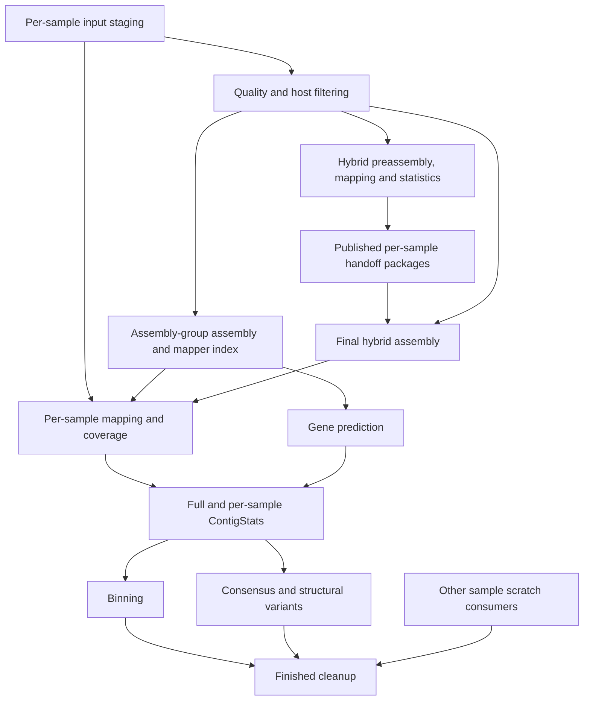

# MATAF4 main-loop submission dependency audit

Date: 2026-09-11. Scope: dependencies created by the main sample loop, their propagation through local helpers and generated worker scripts, assembly groups, hybrid assembly transitions, and scratch cleanup. This follows the separate local-algorithm audit; its original 11 findings remain fixed.

The initial pass corrected **five dependency defects** and retained three findings. The requested follow-up has now **fixed D2 and D3** and applied the explicitly authorized **binning-blocking fallback for D1**. See [the follow-up record](submission-followup.md) and [updated release evidence](submission-release.after-followup.json).

The D1 fallback prevents unsafe binning; it does not implement automatic full ContigStats/variant release for terminal-empty groups. The historical failure descriptions below explain that distinction. Follow-up validation passed its focused suite; the complete checkout has three unrelated IQ-TREE source-assertion failures, detailed in the follow-up record.

## Findings and follow-up status

### D1 — Binning blocked as requested: terminal-empty release omits statistics and variant consumers

**Original audit locations (line numbers precede the follow-up edits):** `MATAF4.pl:1639` (special release), `MATAF4.pl:2163` (normal statistics release), `MATAF4.pl:2325` (normal variant release), `Mods/GenoMetaAss.pm:resetAsGrps`.

When the final map-defined assembly-group member is terminally empty, its special branch can submit the shared assembly, genes, deferred mappings, and binner. It then leaves the sample loop without submitting the normal full ContigStats job, draining `PostClnCmd`, or draining `PostConsCmd`. Those queues are cleared on a subsequent group reset. The normal route explicitly gives the binner the ContigStats dependencies; the special route supplies assembly, annotation, and mapping dependencies only.

The [release probe](submission-release-probe.pl) executes the actual special branch with recording stubs. Its [result](submission-release.json) retains both the statistics and variant command queues while showing a submitted binner. GenomeFace's generated command reads `ContigStats/FMG/FMGids.txt` in `Mods/Binning.pm:runGenomeFace`, so missing full statistics are a concrete unmet input contract, not just omitted bookkeeping. Depending on which outputs already exist, this can cause a failed binner, missing consensus work, or an additional pass that still has no release owner.

There is also a recovery gap after the shared FASTA and assembly stone exist: the terminal-sentinel reopening guard at `MATAF4.pl:850` only checks missing assembly publication. It does not reopen the terminal release member for missing group statistics, bins, or variants. Thus the next pass is not a general repair for this branch.

**Applied fallback:** terminal-empty release no longer calls `submitGenomeBinner`. The empty context cannot safely supply the normal per-sample coverage/statistics inputs, particularly before final hybrid support mapping. The ordinary chained statistics/binning route is preserved. A full future repair would use one group downstream-release routine from both ordinary and empty-member paths, selecting an eligible member's context for statistics. Preserve the ordering assembly/index → mappings and genes → full/per-sample statistics → binning/variants. Group completion must include requested consumers, not just assembly publication. That broader repair still needs coordinated changes to sample completion and group ownership and was not part of the authorized fallback.

### D2 — Fixed: completed empty members were absent from hybrid readiness counts

**Original audit locations (line numbers precede the follow-up edits):** `MATAF4.pl:658` (group count), `MATAF4.pl:850` (terminal reopening guard), `MATAF4.pl:890` (completed-sample early return), `MATAF4.pl:993` (preassembly preparation), `MATAF4.pl:10468` (`prepPreAssmbl`).

For a group ordered `[already-completed empty sample, nonempty sample]`, the first member increments `CntAss`, but its valid terminal sentinel skips `prepPreAssmbl`. Because it is not the final member, `AssemblyGo` is false and the existing terminal-reopening guard does not apply. Its contribution to `CntPreAssNoPrim` is therefore absent. The last member can have a fully published preassembly package yet compute readiness as `1 package + 0 excluded members < 2 members` forever across resets.

The release probe models that early return and then calls the real `prepPreAssmbl` with a complete schema-v2 package. It records `visited_members=2`, `packages=1`, `empty_members_accounted=0`, and `final_hybrid_ready=0`. The small readiness fix below handles an empty member **when that member reaches the helper**; it cannot account for an earlier return that bypasses the helper.

**Fixed:** the validated completed-sample branch now increments `CntPreAssNoPrim` for empty-input, too-small, and cleaned-empty terminal outcomes in assembly mode 5. That branch exits before `prepPreAssmbl`, so the member is counted once per visit without packaging or extra filesystem checks. The updated probe executes this actual early-return branch and reports one excluded member plus one complete package, with final hybrid readiness true.

### D3 — Fixed: legacy external scaffolding dependencies were not propagated

**Original audit locations (line numbers precede the follow-up edits):** `MATAF4.pl:11036` (external scaffolding branch), `MATAF4.pl:5917` (`scaffoldCtgs`), `MATAF4.pl:5883` (`GapFillCtgs`), `MATAF4.pl:2361` (cleanup submission).

The external branch passes `AssemblJobName` to `scaffoldCtgs`, optionally passes its returned job ID to `GapFillCtgs`, and then discards both returned IDs at the controller boundary. Unlike ordinary assembly scaffolding, they are not appended to the assembly dependency or the sample's wait/cleanup dependencies. The central submission helper still records accepted IDs in the sample lock, so these are **not completely untracked jobs**. However, that lock is not a scheduler prerequisite of `submitFinishedCleanup` and does not protect ordinary sample scratch removal.

When external scaffolding runs against an already-published assembly, `AssemblJobName` can also be empty despite pending raw-read staging. `scaffoldCtgs` consumes group raw mate-pair paths but receives no independent group staging barrier. This is conditional on the optional external-scaffolding path having eligible mate libraries; the disabled orthology-placement routine was excluded from this finding.

**Fixed:** `scaffoldCtgs` now includes the existing group `UnzpDeps` in its input dependency. `metagAssemblyRun` returns external scaffold/gap-filling IDs, and both main-loop call sites retain them before any producer-wave early exit. Ordinary assembly mapping does not wait for unrelated external scaffolding. Gap filling is skipped when no scaffold is produced, and its parent directories are created before writing options. Generated-command fixtures cover these paths; BESST/GapFiller themselves were not executed. The existing `operationMode=scaffold` entry-point guard remains in place; this follow-up retains the legacy helpers without reactivating that guarded mode.

## Low-risk corrections implemented

| Defect | Evidence and change |
| --- | --- |
| Blocked prerequisites lost during deferred submission | `qsubSystem(..., immediate=0)` stripped failed/deferred markers and exported a runnable command. Deferred release checked postponement but not failure; bash could execute the consumer after an upstream submission failure. Construction now returns the blocked dependency and no runnable command. Release uses the shared submission failure policy through `submissionDependencyFailed` and `handleSubmissionFailure`. Healthy deferred group jobs keep their existing independent execution. |
| Empty final hybrid member requested another preassembly | The empty-primary branch incremented the excluded-member count but returned `doPreAssmFlag=1, postPreAssmblGo=0`. Empty and no-primary members now share the existing `hybrid_group_ready` path, count once, and request no preassembly of their own. Published final assemblies still bypass package gating. The ordinary package-ready branch also reuses that helper. |
| Terminal-empty cleanup could precede the shared jobs it just submitted | The special release passed an empty input dependency to the synchronous finalizer even after submitting group work. With `useBinnerScratch`, that binner uses the empty release member's scratch. The finalizer now receives the existing normalized sample dependency list, activating its pending-work guard. The cleanup worker's member-lock checks protect assembly indexes only after sample scratch deletion, so they were not a substitute. See [before](submission-release.before.json) and [after](submission-release.json). |
| Nonpareil early exit omitted its jobs from the loop barrier | Its return value was ignored and the branch exited before common sample bookkeeping. The branch now retains Nonpareil, staging/filtering, merging, and already-scheduled read analyses via `add2SampleDeps`. A completed `nopareil` call now returns the existing caller dependency instead of inventing `_NP...` as though a job had been submitted. |
| Supplementary upload preparation absent from sample cleanup prerequisites | Both upload scopes use per-sample temporary directories. Only the primary upload job entered the later publication barrier; the global `EBIjobs` list and submission lock did not order sample cleanup. Both returned upload IDs now enter the existing sample dependency list immediately. This changes preparation bookkeeping only; no external upload was performed. |

The changes reuse `normalise_job_dependencies`, `add2SampleDeps`, `handleSubmissionFailure`, the empty-finalizer pending-work guard, and `hybrid_group_ready`. They do not replace the scheduler abstraction or introduce a second group-state implementation.

## Dependency model checked

For hybrid mode, final support mapping is intentionally held until the canonical final assembly actually exists. Preassembly coverage does not stand in for final-assembly coverage. Package files and manifests are a publication barrier between passes, rather than speculative scheduler IDs. The normal final assembler waits for group cleaned-read dependencies and publishes its staged assembly before its job completes.

| Controller state | Interpretation by consumers |
| --- | --- |
| `SeqClnDeps` | Assembly waits for the group's read producers. |
| `AssemblJobName` | Assembly/index/scaffolding publication prerequisite for mappings and genes. Ordinary assembler wrappers include index construction within their jobs. |
| `PostAssemblCmd` | Earlier members' mapping commands lack an assembly job ID until release. Release adds that barrier while retaining each script's original staging dependencies. |
| `MapDeps`, `prodRun`, publication dependencies | Mapping/depth/publication run in one worker allocation; statistics wait for mapping and annotation products. |
| `PostClnCmd`, `BinDeps` | Normal group release submits full statistics, then the deferred per-sample statistics; binning receives their producer IDs. |
| `PostConsCmd` | Normal final-member release submits queued consensus/SV consumers with assembly, mapping, and statistics prerequisites. Main-loop consensus uses `runLocal=1`, keeping region planning and calling within the dependent allocation. |
| `sampleDeps` and cleanup barrier | Cleanup needs both requested-stage readiness and every known sample scratch consumer. A sample lock ledger alone does not impose this ordering. |
| Loop producer waves | With loop mode enabled, newly submitted producers can defer consumers to a later pass. Group state is reset between passes; published artifacts and durable sample state must reconstruct readiness. |

Also inspected: secondary-reference mapping and index preparation, raw-read profiles and their database barriers, support-only mapping publication, binner mapping discovery, deferred Slurm/SGE/LSF dependency augmentation, and scheduler failure/capacity handling. Support-only mapping writes `done.sto` when the sample has no primary reads, so that path does satisfy the binner's mapping-marker contract. Index-free minimap2/strobealign paths do not require invented index jobs. Existing-reference index checks and package validation were not expanded into new filesystem scans.

## Runtime impact

The dependency fixes add in-memory bookkeeping and checks for exceptional submission states. They add **no scheduler queries, polling loops, directory scans, or healthy-path serialization between group mapping jobs**. Necessary waits now cover previously omitted producers/consumers. This can extend a formerly premature cleanup or controller return, but does not add biological computation.

Two redundancies from the preceding algorithm fixes were reduced:

- `coverage_derivatives_complete` stops at the first nonempty compatible filename for each derivative. A canonical complete result now costs **3 file tests instead of 12**. Legacy and compressed spellings remain accepted; an incomplete derivative still fails.
- Raw DIAMOND hits already default to one read in parser `reads` mode. Only merged-library hits need `MF4:read_count=2`; ordinary libraries no longer undergo an extra decompression/annotation/recompression pass. The mixed-library numerical tests still give five supporting reads and GLN 1.5. The merged-only rewrite remains necessary for this representation and is unchanged in this pass.

[Runtime probe](submission-runtime.pl), [measured results](submission-runtime.json): three repetitions per case, median elapsed time on warm local files, fixture gzip-compatible compressor, 50,000 synthetic hits per library. The baseline is the checkout immediately before this dependency pass, including the previous 11 fixes.

| Measured operation | Before | After |
| --- | ---: | ---: |
| 30,000 complete coverage checks | 0.309 s | 0.222 s |
| Unmerged DIAMOND collection, 150,000 hits | 0.298 s | 0.134 s |
| Mixed DIAMOND collection, 200,000 hits | 0.348 s | 0.155 s |
| Merged-only DIAMOND collection, 50,000 hits | 0.087 s | 0.081 s |

Merged-only differences are ordinary timing variation; the generated work is unchanged. The probe verified identical hit content and multiplicity after removing redundant explicit count-one tags. These measurements support low controller overhead and reduced collection overhead; they are **not an end-to-end HPC runtime guarantee**. Alignment, assembly, shared-filesystem contention, and real scheduler timing were not benchmarked.

To rerun the comparison, pass `submission-runtime.pl` a directory containing the pre-pass `MATAF4.pl`, `Subm.pm`, and `GenoMetaAss.pm`. That snapshot was saved locally at `/tmp/mataf4-dependency-before`; the JSON retains this run's results. `submission-release-probe.pl` runs against the current checkout by default or a supplied `MATAF4.pl`.

## Validation

- The initial fixture reproduced 12 failing assertions across blocked deferred submissions and empty-member readiness; these pass after the corrections.
- `t/main_submission_graph.t`: actual extracted controller bodies, real submission helper, harmless local jobs, fake Slurm endpoint, group release probe, Nonpareil early-exit bookkeeping, and upload cleanup prerequisites.
- Existing `t/functional_provenance.t` and `t/local_algorithm_regressions.t`: **136 checks passed** after the runtime changes.
- Final focused dependency/cleanup suite: **4 files, 296 checks passed**.
- Main-script syntax and scoped `git diff --check` passed.
- Final full suite: `prove -I. -It/lib t/*.t` — **66 files, 2,741 checks passed** (83 seconds on this local checkout).

No production scheduler jobs, biological tools, or external uploads were run. Unrelated catalog/MGS/strain changes in this shared checkout were preserved and are outside this audit.
